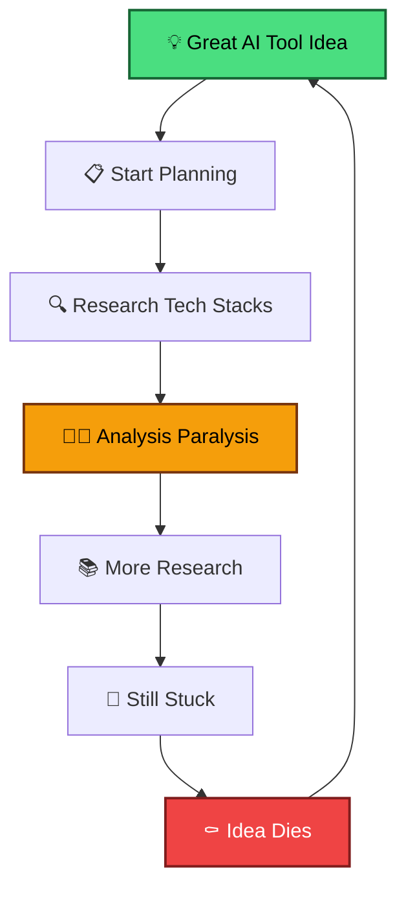

<div class="flex flex-col items-center">
  
  <p class="text-xs text-gray-300 mb-6">(image by <a href="https://texel.ai" target="_blank" class="text-blue-300 hover:text-blue-400">Texel.ai</a>)</p>
  <h1 class="text-5xl font-bold mb-4">Organized AI</h1>
  <h2 class="text-2xl mb-6">Transforming Beginners into Professional Developers Through AI</h2>
  <p class="text-lg italic">The premier community for new coders using AI tools to uplevel skills and monetize ideas</p>
</div>

<div class="pt-12">
  <span @click="$slidev.nav.next" class="px-2 py-1 rounded cursor-pointer" hover="bg-white bg-opacity-10">
    Press Space for next page <carbon:arrow-right class="inline"/>
  </span>
</div>


---
layout: center
class: text-center
---

# The Revolution is Here
## But Most People Are Missing It

<v-clicks>

- **Traditional coding bootcamps**: 12-24 months, $15k+ investment
- **University CS degrees**: 4 years, massive debt
- **Self-taught developers**: Years of struggle, high failure rate

<br>

### Meanwhile, AI tools are democratizing development
*But there's no clear path to leverage them professionally*

</v-clicks>

---
layout: two-cols
---

# The Problem

<v-clicks>

- 🌊 **Overwhelming AI Tool Landscape**
  - Hundreds of coding assistants
  - No clear learning path
  - Most tutorials are surface-level

- ⚡ **Skills Gap**
  - Can build demos, but not production apps
  - Missing engineering best practices
  - No bridge to real-world systems

- 🏝️ **Isolation**
  - Learning alone is hard
  - No community of like-minded learners
  - No mentorship or guidance

</v-clicks>

::right::

# The Opportunity

<v-clicks>

- 💰 **$1.3T Software Market**
  - Growing 8.6% annually
  - Massive developer shortage
  - AI amplifies individual capability

- 🚀 **Speed to Market**
  - Traditional paths too slow
  - Market moving faster than education
  - First-mover advantage available

- 🌍 **Democratization**
  - Geographic barriers removed
  - Age barriers removed
  - Background barriers removed

</v-clicks>

---
layout: center
class: text-center
---

# Our Solution: Organized AI
## The Fast Track from AI Tools to Professional Development

<v-clicks>

<div v-click="1" class="transform transition-all duration-1000 ease-out" :class="$slidev.nav.currentPage >= 4 && $slidev.nav.clicks >= 1 ? 'translate-y-0 opacity-100 scale-100' : 'translate-y-8 opacity-0 scale-95'">

### **🎯 "<span class="text-yellow-300">Vibe Coding</span>" → <span class="text-yellow-300">Engineering Excellence</span>**
*Learn to <span class="text-yellow-300 font-semibold">command</span> AI tools effectively, then scale to <span class="text-yellow-300 font-semibold">production systems</span>*

</div>

<div v-click="2" class="transform transition-all duration-1000 ease-out delay-300" :class="$slidev.nav.currentPage >= 4 && $slidev.nav.clicks >= 2 ? 'translate-x-0 opacity-100 scale-100' : '-translate-x-8 opacity-0 scale-95'">

### **🤝 <span class="text-yellow-300">Community-Driven</span> Learning**
*Learn alongside <span class="text-yellow-300 font-semibold">others</span> on the <span class="text-yellow-300 font-semibold">same journey</span>*

</div>

<div v-click="3" class="transform transition-all duration-1000 ease-out delay-500" :class="$slidev.nav.currentPage >= 4 && $slidev.nav.clicks >= 3 ? 'translate-x-0 opacity-100 scale-100' : 'translate-x-8 opacity-0 scale-95'">

### **💼 <span class="text-yellow-300">Real-World Pipeline</span>**
*From <span class="text-yellow-300 font-semibold">first line of code</span> to <span class="text-yellow-300 font-semibold">landing contracts</span>*

</div>

</v-clicks>

---
layout: two-cols
---

# What Makes Us Different

<v-clicks>

### **🎯 Vibe Coding Methodology**
- Learn to *<span class="text-yellow-300 font-semibold">command</span>* AI tools, not just use them
- Focus on <span class="text-yellow-300 font-semibold">iteration</span> and refinement
- Build <span class="text-yellow-300 font-semibold">intuition</span> for what works

### **🛠️ Hands-On Workshop Format**
- Live events with <span class="text-yellow-300 font-semibold">practical application</span>
- <span class="text-yellow-300 font-semibold">Real-time</span> problem solving
- Immediate <span class="text-yellow-300 font-semibold">feedback</span> and iteration

### **💰 Monetization Focus**
- Not just learning for learning's sake
- Clear path to <span class="text-yellow-300 font-semibold">earning potential</span>
- <span class="text-yellow-300 font-semibold">Real project</span> experience

</v-clicks>

::right::

# The Learning Pipeline

<div class="relative h-full">

<div v-click="1" class="absolute inset-0 transition-all duration-1000 ease-in-out" :class="$slidev.nav.clicks >= 1 && $slidev.nav.clicks < 2 ? 'opacity-100 translate-y-0' : 'opacity-0 translate-y-4'">

## **Phase 1: <span class="text-yellow-300">Foundation</span>** 🌱
<div class="text-lg mt-6 space-y-3">
  <div>• <span class="text-yellow-300 font-semibold">AI tool mastery</span></div>
  <div>• Basic <span class="text-yellow-300 font-semibold">development concepts</span></div>
  <div>• <span class="text-yellow-300 font-semibold">Community onboarding</span></div>
</div>

</div>

<div v-click="2" class="absolute inset-0 transition-all duration-1000 ease-in-out" :class="$slidev.nav.clicks >= 2 && $slidev.nav.clicks < 3 ? 'opacity-100 translate-y-0' : 'opacity-0 translate-y-4'">

## **Phase 2: <span class="text-yellow-300">Application</span>** 🔨
<div class="text-lg mt-6 space-y-3">
  <div>• Live <span class="text-yellow-300 font-semibold">workshops & events</span></div>
  <div>• Real <span class="text-yellow-300 font-semibold">projects & hackathons</span></div>
  <div>• <span class="text-yellow-300 font-semibold">Collaboration skills</span></div>
</div>

</div>

<div v-click="3" class="absolute inset-0 transition-all duration-1000 ease-in-out" :class="$slidev.nav.clicks >= 3 ? 'opacity-100 translate-y-0' : 'opacity-0 translate-y-4'">

## **Phase 3: <span class="text-yellow-300">Professional</span>** 🚀
<div class="text-lg mt-6 space-y-3">
  <div>• <span class="text-yellow-300 font-semibold">Engineering best practices</span></div>
  <div>• <span class="text-yellow-300 font-semibold">Systems thinking</span></div>
  <div>• <span class="text-yellow-300 font-semibold">Career preparation</span></div>
</div>

</div>

</div>

---

# Our Events in Action
## Real People, Real Learning, Real Results

<div class="grid grid-cols-3 gap-8 mb-8">
  <div class="text-center">
    
    <h4 class="text-yellow-300 font-semibold text-base">🎯 Expert Instruction</h4>
    <p class="text-sm">Professional workshops with hands-on guidance</p>
  </div>
  
  <div class="text-center">
    
    <h4 class="text-yellow-300 font-semibold text-base">🌟 Community Learning</h4>
    <p class="text-sm">Diverse participants in welcoming environment</p>
  </div>
  
  <div class="text-center">
    
    <h4 class="text-yellow-300 font-semibold text-base">🤝 Vibe Coding</h4>
    <p class="text-sm">Real collaboration on actual problems</p>
  </div>
</div>

<div class="bg-yellow-100 text-yellow-800 p-6 rounded-lg">
  <h3 class="text-xl font-bold mb-2">✅ This Isn't Just a Concept - We're Already Delivering</h3>
  <p class="text-center">Real events ✦ Real community ✦ Real results</p>
</div>

---

# Building Community & Connections
## Individual Growth in a Supportive Network

<div class="grid grid-cols-2 gap-12 mb-8">
  <div class="text-center">
    
    <h4 class="text-yellow-300 font-semibold text-xl">💻 Individual Growth</h4>
    <p class="text-base">Personal development in supportive setting where every learner can focus and grow at their own pace</p>
  </div>
  
  <div class="text-center">
    
    <h4 class="text-yellow-300 font-semibold text-xl">🚀 Real Connections</h4>
    <p class="text-base">Building meaningful networks at top-tier venues like Antler - opening doors to real opportunities</p>
  </div>
</div>

<div class="bg-gradient-to-r from-purple-100 to-blue-100 text-purple-800 p-6 rounded-lg">
  <h3 class="text-xl font-bold mb-2 text-center">🌟 From Learning to Leading</h3>
  <p class="text-center">We create environments where individual growth flourishes and professional connections emerge naturally</p>
</div>

---
layout: center
class: text-center
---

# Our Events: Two Tracks, One Community
## Bridging AI Innovation with Traditional Excellence

<v-clicks>

### **🚀 Vibe Coding Hackathons**
*For AI-assisted developers learning to command tools effectively*
- Focus on rapid iteration and AI collaboration
- Emphasis on creative problem-solving
- Building intuition for AI-human workflows

### **⚡ Traditional Competitive Tracks**
*For builders who want conventional coding challenges*
- Algorithm-focused competitions
- Performance optimization challenges
- Classic software engineering problems

<br>

> *"Whether you're prompting or programming, we meet you where you are"*

</v-clicks>

---
layout: center
class: text-center
---

# Proof of Concept
## This Actually Works

<v-clicks>

### **Jordaaan Hill's Journey**
*Founder of Organized AI*

- **Started**: Complete coding beginner
- **Timeline**: 6 months of focused learning
- **Outcome**: Landed contract at Array.com ($1.01B startup)
- **Method**: Effective AI tool usage + community learning

<br>

> *"If I can do it in 6 months, imagine what a whole community can achieve together"*

</v-clicks>

---
layout: two-cols
---

# Community & Partners

<v-clicks>

### **Current Offerings**
- **Live Workshops**: Hands-on learning sessions
- **Vibe Coding Hackathons**: AI-focused building
- **Traditional Competitions**: Classic coding challenges
- **Starter Stacks**: Pre-built development resources

### **Strategic Partners**
<div class="flex items-center gap-4 mt-4">
  
  <div>
    <a href="https://aitxcommunity.com" class="text-blue-300 hover:text-blue-100 font-semibold">AITX Community</a>
    <p class="text-sm text-gray-300">AI & Tech Excellence</p>
  </div>
</div>

### **Event Links**
- [Main Community](https://lu.ma/Organizedai)
- [Starter Stacks](https://lu.ma/organizedai-starterstacks)

</v-clicks>

::right::

# Why This Approach Works

<v-clicks>

### **Inclusive Learning**
- Multiple paths to the same goal
- No judgment on methodology
- Focus on results, not process

### **Real-World Application**
- Immediate practice opportunities
- Building while learning
- Community feedback loops

### **Strategic Partnerships**
- Aligned with leading AI communities
- Shared vision for development education
- Expanded opportunities for learners

### **Market Timing**
- AI tools reaching maturity
- Hybrid approaches becoming norm
- Both skills needed in industry

</v-clicks>

---
layout: center
class: text-center
---

# The Vision
## Democratizing Professional Development

<v-clicks>

### **Short-term (6-12 months)**
- 1,000+ active community members
- Monthly live events and hackathons
- 50+ successful career transitions

### **Medium-term (1-2 years)**
- Corporate training partnerships
- Accredited certification program
- Global community chapters with local events

### **Long-term (3-5 years)**
- The go-to platform for AI-powered development education
- Alumni network at top tech companies
- Industry-recognized dual-track methodology

</v-clicks>

---
layout: two-cols
---

# Join the Revolution

<v-clicks>

### **For Learners**
- Choose your track: Vibe Coding or Traditional
- Learn through hands-on workshops
- Connect with like-minded developers
- Get real project experience

### **For Partners & Sponsors**
- Access to emerging talent pool
- Sponsor innovative hackath events
- Early involvement in new paradigm
- Direct pipeline to motivated developers

</v-clicks>

::right::

# Ready to Get Started?

<v-clicks>

### **Community Links**
- 🌐 [Join Organized AI](https://lu.ma/Organizedai)
- 🚀 [Starter Stacks](https://lu.ma/organizedai-starterstacks)

<div class="flex items-center gap-3 mt-4 justify-center">
  
  <a href="https://aitxcommunity.com" class="text-blue-300 hover:text-blue-100">AITX Community</a>
</div>

### **Next Events**
- Live workshops and hackathons
- Both Vibe Coding and Traditional tracks
- Hands-on learning opportunities

### **Contact**
- 👨‍💻 Jordaaan Hill, Founder

<br>

> *"The best time to start building is now"*

</v-clicks>

---
layout: center
class: text-center
---
layout: center
class: text-center
background: 'linear-gradient(135deg, #667eea 0%, #764ba2 100%)'
---

# Part 2: StarterStacks
## The Speed Revolution

<div class="text-lg mb-6">
Now let's dive into our flagship technical methodology:
</div>

<v-clicks>

### **10 AI Tool Stacks That Get You From Idea to Users in Hours, Not Weeks**

<div class="text-base space-y-2 max-w-4xl mx-auto">

- Eliminates planning paralysis affecting 80% of developers
- Session-based development optimized for Claude usage  
- Real success stories: 20 minutes to 3 days for complete MVPs
- Complete organized framework for vibe coding

</div>

</v-clicks>

---

# The Vibe Coding Problem
## Why 80% of Development Time is Wasted

<div class="flex flex-col items-center max-w-6xl mx-auto">

<div class="w-full max-w-3xl">


```mermaid
graph TD
    A["💡 Great AI Tool Idea"] --> B["📋 Start Planning"]
    B --> C["🔍 Research Tech Stacks"]
    C --> D["😵‍💫 Analysis Paralysis"] 
    D --> E["📚 More Research"]
    E --> F["🚫 Still Stuck"]
    F --> G["⚰️ Idea Dies"]
    G --> A
    
    style A fill:#4ade80,stroke:#166534,stroke-width:2px,color:#000
    style G fill:#ef4444,stroke:#7f1d1d,stroke-width:2px,color:#fff
    style D fill:#f59e0b,stroke:#78350f,stroke-width:2px,color:#000
```

</div>

<v-clicks>

<div class="mt-6 text-center">

### **The Statistics That Matter**
<div class="grid grid-cols-3 gap-4 text-sm max-w-4xl mx-auto">
<div>🎯 **80% of time** spent on decisions</div>
<div>⏱️ **3-4 weeks** idea to code</div>
<div>💀 **60% of projects** never start</div>
</div>

</div>

</v-clicks>

</div>

---

# The Solution: Organized Vibe Coding
## Framework + Process = Speed

<div class="grid grid-cols-2 gap-8 max-w-5xl mx-auto">

<div class="space-y-3">

### ❌ **Traditional Approach**
<div class="text-sm space-y-1">

- "Just use React"
- "Python is best for AI"  
- "Start simple"
- Generic blog advice
- Analysis paralysis

</div>

</div>

<div class="space-y-3">

### ✅ **Organized Approach**
<div class="text-sm space-y-1">

- **5-question evaluator** → personalized stack
- **Pre-built templates** → immediate start
- **Session budgets** → predictable costs
- **Verification checklists** → working code

</div>

</div>

</div>

<v-clicks>

<div class="text-center pt-6">

## **Result: 20 minutes to 3 days** instead of **weeks to never**

</div>

</v-clicks>

---

# Stack Evaluator in Action
## https://web-fpi95p595-jordaaans-projects.vercel.app/

<div class="grid grid-cols-2 gap-8 max-w-5xl mx-auto">

<div class="space-y-4">

### **5 Strategic Questions**
<div class="text-sm space-y-2">

1. 👤 **Technical background?**
   Non-technical to AI/ML specialist

2. ⚡ **Speed needed?**
   30 minutes to weekend MVP

3. 🛠️ **Tool type?**
   Chat, analysis, content, workflows

4. 👥 **Team size?**
   Solo to enterprise

5. 🌐 **Deployment?**
   Cloud, edge, hybrid

</div>

</div>

<div class="space-y-4">

### **Instant Results**
<div class="text-sm space-y-2">

- **Personalized recommendation** in 30 seconds
- **Direct template links** to start building
- **Session budget estimates** for Claude usage
- **Verification checklist** included

</div>

<div class="text-center pt-4">
<a href="https://web-fpi95p595-jordaaans-projects.vercel.app/" class="text-blue-300 text-lg">→ Try Live Demo</a>
</div>

</div>

</div>

---

# 10 Curated Stacks
## From Minutes to Production

<div class="max-w-6xl mx-auto">

<div class="grid grid-cols-2 gap-6 text-sm">

<div class="space-y-4">

<div class="bg-green-500 bg-opacity-20 p-3 rounded">
### **⚡ Ultra Fast (15min-2hrs)**
**Stack 7**: v0.dev + StackBlitz  
**Stack 8**: Zapier + Bubble  
**Stack 9**: Glitch Remix
</div>

<div class="bg-blue-500 bg-opacity-20 p-3 rounded">
### **🚀 Quick MVPs (1-3 days)**  
**Stack 1**: Next.js + Vercel AI  
**Stack 10**: Cursor + Copilot  
**Stack 6**: Lovable + Supabase
</div>

</div>

<div class="space-y-4">

<div class="bg-purple-500 bg-opacity-20 p-3 rounded">
### **🏗️ Production (2 days-2 weeks)**
**Stack 2**: FastAPI + Streamlit  
**Stack 3**: React + Express  
**Stack 4**: n8n + Supabase
</div>

<div class="bg-gray-500 bg-opacity-20 p-3 rounded">
### **🔧 AI-Enhanced**
**Stack 5**: Claude Code + MCP  
All stacks include templates, checklists, budgets
</div>

</div>

</div>

</div>

---

# Session-Based Development
## Why This Changes Everything

<div class="grid grid-cols-2 gap-8 max-w-5xl mx-auto">

<div class="space-y-4">

### **Traditional Problems**
<div class="text-sm space-y-2">

- 💸 Unpredictable Claude costs
- 🔄 Hidden complexity explosions
- ⏰ No time estimates  
- 🤷‍♂️ "It depends" everywhere

</div>

</div>

<div class="space-y-4">

### **Our Solution**
<div class="text-sm space-y-2">

- 💰 **Token budgets** per feature
- 📊 **Session estimates** upfront
- ⚡ **Rate limit coordination**
- 📋 **Predictable patterns**

</div>

</div>

</div>

<v-clicks>

<div class="mt-6 max-w-4xl mx-auto">

### **Example Budget Planning**
<div class="bg-gray-800 p-3 rounded text-xs">

```
Phase 1: Core MVP    (15 sessions, 2M tokens)
Phase 2: UI Polish   (8 sessions, 800K tokens)  
Phase 3: Integration (12 sessions, 1.5M tokens)
Phase 4: Deployment  (5 sessions, 400K tokens)

Total Budget: 40 sessions, 4.7M tokens ≈ $75
```

</div>

</div>

</v-clicks>

---

# Development Types Matter
## Choose Your Approach

<div class="max-w-6xl mx-auto">

<div class="grid grid-cols-2 gap-8">

<div class="space-y-4">

<div class="bg-green-500 bg-opacity-20 p-4 rounded">
### **🚀 Vibe Coding**
*Leaf nodes only*
<div class="text-sm mt-2 space-y-1">

- Fast iteration, tech debt OK
- Manual verification
- Perfect for features
- **Example**: Profile pages, templates

</div>
</div>

<div class="bg-blue-500 bg-opacity-20 p-4 rounded">
### **🏗️ Structured**  
*Core architecture*
<div class="text-sm mt-2 space-y-1">

- Interface-first design
- Comprehensive testing
- Future-proof foundations
- **Example**: Auth, database schema

</div>
</div>

</div>

<div class="flex items-center justify-center">

<div class="bg-purple-500 bg-opacity-20 p-4 rounded w-full">
### **🤖 Agent Development**
*AI-powered workflows*
<div class="text-sm mt-2 space-y-1">

- Tool coordination & error handling
- Monitoring setup & automation focus  
- **Example**: CI/CD, content processing

</div>
</div>

</div>

</div>

<div class="text-center pt-4 text-sm">
**Key Insight**: Right approach for right component = 10x speed improvement
</div>

</div>

---

# Claude Code Framework
## Master Prompt System

<div class="max-w-5xl mx-auto">

<div class="bg-gray-800 p-4 rounded text-xs">

```bash
**Role**: Expert architect for [FRAMEWORK_NAME]
**Project**: Building [TYPE] with [STACK_NAME]
**Budget**: $100 Claude Max (optimize tokens)
**Timeline**: [X] sessions (5-hour blocks)

**Principles**:
- Focus on leaf nodes (nothing depends on them)
- Simple tasks: Max 5 tool calls
- Complex features: Max 15 tool calls
- Stop when requirements met
```

</div>

<v-clicks>

<div class="mt-6">

### **What This Gives You**
<div class="grid grid-cols-2 gap-6 text-sm">

<div class="space-y-2">

- ✅ **Predictable token usage** - no runaway costs
- ✅ **Quality boundaries** - clear "good enough" criteria

</div>

<div class="space-y-2">

- ✅ **Verification built-in** - test without reading all code  
- ✅ **Architecture guidance** - right approach per component

</div>

</div>

</div>

</v-clicks>

</div>

---

# Real Success Stories
## Why This Actually Works

<div class="grid grid-cols-2 gap-8 max-w-5xl mx-auto">

<div class="space-y-4">

### **📊 Actual Results**
<div class="text-sm space-y-2">

- **20-minute demo**: AI content generator for client meeting
- **2-hour system**: Non-technical founder built AI customer support
- **3-day deployment**: Chat interface serving 1000+ users
- **1 week vs 1 month**: Complex AI platform with pair programming

</div>

</div>

<div class="space-y-4">

### **🎯 The Numbers**
<div class="text-sm space-y-2">

- **45M+ developers** worldwide need this
- **10-50x speed improvement** over traditional planning  
- **$1000s saved** on wrong technology choices
- **100+ hours saved** per developer (weeks → minutes)

</div>

</div>

</div>

<v-clicks>

<div class="text-center pt-6">

**The difference**: Organized frameworks + Vibe coding + Budget management

</div>

</v-clicks>

---

# Start Today: 3 Simple Steps
## Implementation

<div class="grid grid-cols-3 gap-6 max-w-6xl mx-auto text-center">

<div class="space-y-3">

### **1. Evaluate** ⚡
<div class="text-sm space-y-2">

Visit **web-fpi95p595-jordaaans-projects.vercel.app**

Answer 5 questions  
Get personalized stack  
Budget estimate included

</div>

</div>

<div class="space-y-3">

### **2. Build** 🚀
<div class="text-sm space-y-2">

Clone your template

Follow the checklist  
Use session budgets  
Verify as you go

</div>

</div>

<div class="space-y-3">

### **3. Scale** 📈
<div class="text-sm space-y-2">

Join the community

Share your results  
Help others succeed  
Keep improving

</div>

</div>

</div>

<v-clicks>

<div class="text-center pt-6">

### **Community Links**
<div class="text-sm">
🌐 **web-fpi95p595-jordaaans-projects.vercel.app** • 📚 **github.com/Organized-AI/starter-stacks** • 💬 **lu.ma/Organizedai**
</div>

</div>

</v-clicks>

---

# Why Organized Frameworks Win
## The Speed Revolution

<div class="grid grid-cols-2 gap-8 max-w-5xl mx-auto">

<div class="space-y-4">

### **Without Framework**
<div class="text-sm space-y-2">

- Every project starts from scratch
- Repeat the same research
- Analysis paralysis every time  
- Unpredictable results and costs
- High failure rate

</div>

</div>

<div class="space-y-4">

### **With Organized Framework**
<div class="text-sm space-y-2">

- Pre-validated technology choices
- Session budgets and token estimates
- Clear verification checklists
- Predictable timeline and costs
- High success rate

</div>

</div>

</div>

<v-clicks>

<div class="text-center pt-8">

## **From Planning Paralysis to Shipping Products**

### **Ready to join the Speed Revolution?**

<div class="text-lg mt-4">
<a href="https://web-fpi95p595-jordaaans-projects.vercel.app/" class="text-blue-300">→ Start with the Stack Evaluator</a>
</div>

</div>

</v-clicks>


---
layout: center
class: text-center

# Part 2: AI Opportunity Identification

**A Strategic Framework for Elite Entrepreneurs**

<div class="text-lg opacity-75 mt-4">
Identifying When to Use AI for 7-Figure Impact
</div>

<div class="pt-8">
🎯 Ready to unlock your AI opportunities?
</div>


**A Strategic Framework for Elite Entrepreneurs**

<div class="pt-12">
  <span @click="$slidev.nav.next" class="px-2 py-1 rounded cursor-pointer" hover="bg-white bg-opacity-10">
    Let's unlock your 7-figure AI opportunities →
  </span>
</div>

<div class="abs-br m-6 flex gap-2">
  <a href="https://github.com/slidevjs/slidev" target="_blank" alt="GitHub"
    class="text-xl slidev-icon-btn opacity-50 !border-none !hover:text-white">
    <carbon-logo-github />
  </a>
</div>

---

# The $12 Trillion Question

<v-clicks>

- **McKinsey**: AI could contribute up to $13 trillion to global economic output by 2030
- **But 70% of AI projects fail** before reaching production
- **The difference?** Knowing WHEN to use AI vs. WHAT AI can do

</v-clicks>

<div v-click class="mt-8 p-4 bg-blue-100 rounded-lg">
💡 <strong>Key Insight:</strong> Success isn't about having the newest AI tool—it's about identifying the right problems to solve.
</div>

---

# The Elite Entrepreneur's AI Dilemma

<div class="grid grid-cols-2 gap-8">

<div>

## ❌ What Most Do
- Chase shiny AI objects
- Ask "What can AI do?"
- Technology-first thinking
- Copy competitors blindly
- Implement without strategy

</div>

<div>

## ✅ What Winners Do
- Identify strategic bottlenecks
- Ask "What problems cost me millions?"
- Business-first thinking
- Create competitive moats
- Implement with precision

</div>

</div>

---

# The SCALE Framework
**Strategic AI Identification for 7-Figure Impact**

<div class="grid grid-cols-1 gap-4 mt-8">

<div class="flex items-center gap-4 p-4 bg-gradient-to-r from-blue-50 to-blue-100 rounded-lg">
  <div class="text-2xl font-bold text-blue-600">S</div>
  <div><strong>Size:</strong> Is this problem worth $100K+ annually?</div>
</div>

<div class="flex items-center gap-4 p-4 bg-gradient-to-r from-green-50 to-green-100 rounded-lg">
  <div class="text-2xl font-bold text-green-600">C</div>
  <div><strong>Certainty:</strong> Can we define clear success metrics?</div>
</div>

<div class="flex items-center gap-4 p-4 bg-gradient-to-r from-purple-50 to-purple-100 rounded-lg">
  <div class="text-2xl font-bold text-purple-600">A</div>
  <div><strong>Availability:</strong> Do we have quality data and resources?</div>
</div>

<div class="flex items-center gap-4 p-4 bg-gradient-to-r from-orange-50 to-orange-100 rounded-lg">
  <div class="text-2xl font-bold text-orange-600">L</div>
  <div><strong>Leverage:</strong> Will this create exponential returns?</div>
</div>

<div class="flex items-center gap-4 p-4 bg-gradient-to-r from-red-50 to-red-100 rounded-lg">
  <div class="text-2xl font-bold text-red-600">E</div>
  <div><strong>Execution:</strong> Can our team implement and maintain this?</div>
</div>

</div>

---

# The 4 AI Opportunity Categories

<div class="grid grid-cols-2 gap-6">

<div class="p-6 bg-gradient-to-br from-blue-50 to-blue-100 rounded-lg">
<h3 class="text-xl font-bold text-blue-800 mb-3">🚀 Revenue Accelerators</h3>
<ul class="text-sm space-y-2">
<li>Personalized customer experiences</li>
<li>Dynamic pricing optimization</li>
<li>Predictive sales forecasting</li>
<li>Content generation at scale</li>
</ul>
</div>

<div class="p-6 bg-gradient-to-br from-green-50 to-green-100 rounded-lg">
<h3 class="text-xl font-bold text-green-800 mb-3">💰 Cost Eliminators</h3>
<ul class="text-sm space-y-2">
<li>Process automation</li>
<li>Quality control systems</li>
<li>Customer service automation</li>
<li>Administrative task reduction</li>
</ul>
</div>

<div class="p-6 bg-gradient-to-br from-purple-50 to-purple-100 rounded-lg">
<h3 class="text-xl font-bold text-purple-800 mb-3">⚡ Speed Multipliers</h3>
<ul class="text-sm space-y-2">
<li>Rapid prototyping</li>
<li>Instant decision making</li>
<li>Real-time optimization</li>
<li>Automated reporting</li>
</ul>
</div>

<div class="p-6 bg-gradient-to-br from-orange-50 to-orange-100 rounded-lg">
<h3 class="text-xl font-bold text-orange-800 mb-3">🛡️ Risk Reducers</h3>
<ul class="text-sm space-y-2">
<li>Fraud detection</li>
<li>Predictive maintenance</li>
<li>Market trend analysis</li>
<li>Compliance monitoring</li>
</ul>
</div>

</div>

---

# Case Study: $12M Revenue Stream

<div class="grid grid-cols-2 gap-8">

<div>

## The Problem
- **Company**: E-commerce rollup
- **Challenge**: Product research taking 40+ hours per opportunity
- **Cost**: $2M+ in missed opportunities annually
- **Pain**: Analysts burned out, inconsistent quality

</div>

<div>

## The AI Solution
- **Approach**: Automated market analysis system
- **Implementation**: 6 weeks, $50K investment
- **Result**: 40 hours → 2 hours per analysis
- **ROI**: $12M in new revenue streams identified

</div>

</div>

<div class="mt-8 p-4 bg-yellow-100 rounded-lg">
🎯 <strong>SCALE Check:</strong> Size ✓ ($2M+ problem), Certainty ✓ (clear metrics), Availability ✓ (market data), Leverage ✓ (20x time savings), Execution ✓ (existing team)
</div>

---

# The AI Readiness Assessment

## Before You Implement, Ask These Questions:

<v-clicks>

1. **📊 Data Quality**: "Is our data clean, labeled, and representative?"
2. **🎯 Success Metrics**: "How will we measure if this AI solution works?"
3. **👥 Team Capability**: "Do we have someone who can maintain this?"
4. **💼 Business Impact**: "Will this move the needle on our core KPIs?"
5. **⚖️ Risk Tolerance**: "What happens if this fails spectacularly?"

</v-clicks>

<div v-click class="mt-6 p-4 bg-red-100 rounded-lg">
⚠️ <strong>Red Flag:</strong> If you can't answer all 5 confidently, wait. Bad AI is worse than no AI.
</div>

---

# The 3-2-1 Priority Matrix

<div class="grid grid-cols-3 gap-6">

<div class="p-6 bg-gradient-to-br from-green-50 to-green-100 rounded-lg border-2 border-green-300">
<h3 class="text-xl font-bold text-green-800 mb-3">🟢 Implement Now</h3>
<ul class="text-sm space-y-2">
<li><strong>High impact</strong></li>
<li><strong>Low complexity</strong></li>
<li><strong>Clear ROI</strong></li>
<li><strong>Existing data</strong></li>
</ul>
<div class="mt-4 text-xs text-green-700">
<strong>Examples:</strong> Email automation, basic chatbots, simple analytics
</div>
</div>

<div class="p-6 bg-gradient-to-br from-yellow-50 to-yellow-100 rounded-lg border-2 border-yellow-300">
<h3 class="text-xl font-bold text-yellow-800 mb-3">🟡 Plan & Pilot</h3>
<ul class="text-sm space-y-2">
<li><strong>High impact</strong></li>
<li><strong>Medium complexity</strong></li>
<li><strong>Data needs work</strong></li>
<li><strong>Team skill gaps</strong></li>
</ul>
<div class="mt-4 text-xs text-yellow-700">
<strong>Examples:</strong> Predictive analytics, recommendation engines, process optimization
</div>
</div>

<div class="p-6 bg-gradient-to-br from-red-50 to-red-100 rounded-lg border-2 border-red-300">
<h3 class="text-xl font-bold text-red-800 mb-3">🔴 Wait & Watch</h3>
<ul class="text-sm space-y-2">
<li><strong>Uncertain impact</strong></li>
<li><strong>High complexity</strong></li>
<li><strong>Immature technology</strong></li>
<li><strong>Competitive risk</strong></li>
</ul>
<div class="mt-4 text-xs text-red-700">
<strong>Examples:</strong> Cutting-edge AI research, unproven use cases, complex ML models
</div>
</div>

</div>

---

# Your AI Opportunity Map

## Live Workshop Exercise (5 minutes)

<div class="p-6 bg-gray-50 rounded-lg">

**Step 1**: List your top 3 business bottlenecks costing $100K+ annually

**Step 2**: For each, rate 1-10:
- How repetitive is this problem?
- How much data do we have?
- How clear are success metrics?
- How urgent is solving this?

**Step 3**: Apply the SCALE framework

**Step 4**: Identify your #1 AI opportunity

</div>

<div class="mt-4 text-center">
<strong>🎯 Goal:</strong> Leave with one concrete AI implementation plan
</div>

---

# The Implementation Roadmap

<div class="grid grid-cols-4 gap-4">

<div class="p-4 bg-blue-50 rounded-lg">
<h4 class="font-bold text-blue-800">Week 1-2</h4>
<div class="text-sm mt-2">
<strong>Validate</strong>
<ul class="mt-1 space-y-1">
<li>• Confirm problem size</li>
<li>• Audit data quality</li>
<li>• Set success metrics</li>
</ul>
</div>
</div>

<div class="p-4 bg-green-50 rounded-lg">
<h4 class="font-bold text-green-800">Week 3-4</h4>
<div class="text-sm mt-2">
<strong>Design</strong>
<ul class="mt-1 space-y-1">
<li>• Choose AI approach</li>
<li>• Plan integration</li>
<li>• Build prototype</li>
</ul>
</div>
</div>

<div class="p-4 bg-orange-50 rounded-lg">
<h4 class="font-bold text-orange-800">Week 5-8</h4>
<div class="text-sm mt-2">
<strong>Build</strong>
<ul class="mt-1 space-y-1">
<li>• Develop solution</li>
<li>• Test thoroughly</li>
<li>• Train team</li>
</ul>
</div>
</div>

<div class="p-4 bg-purple-50 rounded-lg">
<h4 class="font-bold text-purple-800">Week 9+</h4>
<div class="text-sm mt-2">
<strong>Scale</strong>
<ul class="mt-1 space-y-1">
<li>• Monitor performance</li>
<li>• Iterate quickly</li>
<li>• Expand scope</li>
</ul>
</div>
</div>

</div>

---

# Key Takeaways

<v-clicks>

<div class="p-4 bg-blue-100 rounded-lg mb-4">
<strong>🎯 Think Business First:</strong> Start with problems worth $100K+, not cool technology
</div>

<div class="p-4 bg-green-100 rounded-lg mb-4">
<strong>📏 Use the SCALE Framework:</strong> Size, Certainty, Availability, Leverage, Execution
</div>

<div class="p-4 bg-purple-100 rounded-lg mb-4">
<strong>🚀 Focus on Leverage:</strong> Look for 10x improvements, not 10% gains
</div>

<div class="p-4 bg-orange-100 rounded-lg mb-4">
<strong>⚡ Start Small, Scale Fast:</strong> Pilot quickly, then expand what works
</div>

<div class="p-4 bg-red-100 rounded-lg">
<strong>🛡️ Avoid the Hype:</strong> Bad AI is worse than no AI—be selective
</div>

</v-clicks>

---

# Q&A + Your AI Opportunities

<div class="text-center text-6xl mb-8">🤔💭</div>

<div class="text-center text-2xl">
**Let's identify your next 7-figure AI opportunity**
</div>

<div class="mt-8 p-6 bg-gradient-to-r from-blue-50 to-purple-50 rounded-lg">
<p class="text-center">
Share your biggest business bottleneck and let's apply the SCALE framework together
</p>
</div>

<div class="mt-8 text-center text-sm opacity-75">
Follow-up: Schedule a 1:1 AI Strategy Session
</div>

---
layout: end
---

# Thank You

**Ready to unlock your 7-figure AI opportunities?**

<div class="mt-8">
Contact for AI Strategy Sessions:<br>
<strong>[Your Contact Information]</strong>
</div>

<div class="mt-8 text-sm opacity-75">
Presentation materials and frameworks available for download
</div>
