<div class="flex flex-col items-center">
  
  <p class="text-xs text-gray-300 mb-6">(image by <a href="https://texel.ai" target="_blank" class="text-blue-300 hover:text-blue-400">Texel.ai</a>)</p>
  <h1 class="text-5xl font-bold mb-4">Organized AI</h1>
  <h2 class="text-2xl mb-6">Transforming Beginners into Professional Developers Through AI</h2>
  <p class="text-lg italic">The premier community for new coders using AI tools to uplevel skills and monetize ideas</p>
</div>

<div class="pt-12">
  <span @click="$slidev.nav.next" class="px-2 py-1 rounded cursor-pointer" hover="bg-white bg-opacity-10">
    Press Space for next page <carbon:arrow-right class="inline"/>
  </span>
</div>


---
layout: center
class: text-center
---

# The Revolution is Here
## But Most People Are Missing It

<v-clicks>

- **Traditional coding bootcamps**: 12-24 months, $15k+ investment
- **University CS degrees**: 4 years, massive debt
- **Self-taught developers**: Years of struggle, high failure rate

<br>

### Meanwhile, AI tools are democratizing development
*But there's no clear path to leverage them professionally*

</v-clicks>

---
layout: two-cols
---

# The Problem

<v-clicks>

- 🌊 **Overwhelming AI Tool Landscape**
  - Hundreds of coding assistants
  - No clear learning path
  - Most tutorials are surface-level

- ⚡ **Skills Gap**
  - Can build demos, but not production apps
  - Missing engineering best practices
  - No bridge to real-world systems

- 🏝️ **Isolation**
  - Learning alone is hard
  - No community of like-minded learners
  - No mentorship or guidance

</v-clicks>

::right::

# The Opportunity

<v-clicks>

- 💰 **$1.3T Software Market**
  - Growing 8.6% annually
  - Massive developer shortage
  - AI amplifies individual capability

- 🚀 **Speed to Market**
  - Traditional paths too slow
  - Market moving faster than education
  - First-mover advantage available

- 🌍 **Democratization**
  - Geographic barriers removed
  - Age barriers removed
  - Background barriers removed

</v-clicks>

---
layout: center
class: text-center
---

# Our Solution: Organized AI
## The Fast Track from AI Tools to Professional Development

<v-clicks>

<div v-click="1" class="transform transition-all duration-1000 ease-out" :class="$slidev.nav.currentPage >= 4 && $slidev.nav.clicks >= 1 ? 'translate-y-0 opacity-100 scale-100' : 'translate-y-8 opacity-0 scale-95'">

### **🎯 "<span class="text-yellow-300">Vibe Coding</span>" → <span class="text-yellow-300">Engineering Excellence</span>**
*Learn to <span class="text-yellow-300 font-semibold">command</span> AI tools effectively, then scale to <span class="text-yellow-300 font-semibold">production systems</span>*

</div>

<div v-click="2" class="transform transition-all duration-1000 ease-out delay-300" :class="$slidev.nav.currentPage >= 4 && $slidev.nav.clicks >= 2 ? 'translate-x-0 opacity-100 scale-100' : '-translate-x-8 opacity-0 scale-95'">

### **🤝 <span class="text-yellow-300">Community-Driven</span> Learning**
*Learn alongside <span class="text-yellow-300 font-semibold">others</span> on the <span class="text-yellow-300 font-semibold">same journey</span>*

</div>

<div v-click="3" class="transform transition-all duration-1000 ease-out delay-500" :class="$slidev.nav.currentPage >= 4 && $slidev.nav.clicks >= 3 ? 'translate-x-0 opacity-100 scale-100' : 'translate-x-8 opacity-0 scale-95'">

### **💼 <span class="text-yellow-300">Real-World Pipeline</span>**
*From <span class="text-yellow-300 font-semibold">first line of code</span> to <span class="text-yellow-300 font-semibold">landing contracts</span>*

</div>

</v-clicks>

---
layout: two-cols
---

# What Makes Us Different

<v-clicks>

### **🎯 Vibe Coding Methodology**
- Learn to *<span class="text-yellow-300 font-semibold">command</span>* AI tools, not just use them
- Focus on <span class="text-yellow-300 font-semibold">iteration</span> and refinement
- Build <span class="text-yellow-300 font-semibold">intuition</span> for what works

### **🛠️ Hands-On Workshop Format**
- Live events with <span class="text-yellow-300 font-semibold">practical application</span>
- <span class="text-yellow-300 font-semibold">Real-time</span> problem solving
- Immediate <span class="text-yellow-300 font-semibold">feedback</span> and iteration

### **💰 Monetization Focus**
- Not just learning for learning's sake
- Clear path to <span class="text-yellow-300 font-semibold">earning potential</span>
- <span class="text-yellow-300 font-semibold">Real project</span> experience

</v-clicks>

::right::

# The Learning Pipeline

<div class="relative h-full">

<div v-click="1" class="absolute inset-0 transition-all duration-1000 ease-in-out" :class="$slidev.nav.clicks >= 1 && $slidev.nav.clicks < 2 ? 'opacity-100 translate-y-0' : 'opacity-0 translate-y-4'">

## **Phase 1: <span class="text-yellow-300">Foundation</span>** 🌱
<div class="text-lg mt-6 space-y-3">
  <div>• <span class="text-yellow-300 font-semibold">AI tool mastery</span></div>
  <div>• Basic <span class="text-yellow-300 font-semibold">development concepts</span></div>
  <div>• <span class="text-yellow-300 font-semibold">Community onboarding</span></div>
</div>

</div>

<div v-click="2" class="absolute inset-0 transition-all duration-1000 ease-in-out" :class="$slidev.nav.clicks >= 2 && $slidev.nav.clicks < 3 ? 'opacity-100 translate-y-0' : 'opacity-0 translate-y-4'">

## **Phase 2: <span class="text-yellow-300">Application</span>** 🔨
<div class="text-lg mt-6 space-y-3">
  <div>• Live <span class="text-yellow-300 font-semibold">workshops & events</span></div>
  <div>• Real <span class="text-yellow-300 font-semibold">projects & hackathons</span></div>
  <div>• <span class="text-yellow-300 font-semibold">Collaboration skills</span></div>
</div>

</div>

<div v-click="3" class="absolute inset-0 transition-all duration-1000 ease-in-out" :class="$slidev.nav.clicks >= 3 ? 'opacity-100 translate-y-0' : 'opacity-0 translate-y-4'">

## **Phase 3: <span class="text-yellow-300">Professional</span>** 🚀
<div class="text-lg mt-6 space-y-3">
  <div>• <span class="text-yellow-300 font-semibold">Engineering best practices</span></div>
  <div>• <span class="text-yellow-300 font-semibold">Systems thinking</span></div>
  <div>• <span class="text-yellow-300 font-semibold">Career preparation</span></div>
</div>

</div>

</div>

---

# Our Events in Action
## Real People, Real Learning, Real Results

<div class="grid grid-cols-3 gap-8 mb-8">
  <div class="text-center">
    
    <h4 class="text-yellow-300 font-semibold text-base">🎯 Expert Instruction</h4>
    <p class="text-sm">Professional workshops with hands-on guidance</p>
  </div>
  
  <div class="text-center">
    
    <h4 class="text-yellow-300 font-semibold text-base">🌟 Community Learning</h4>
    <p class="text-sm">Diverse participants in welcoming environment</p>
  </div>
  
  <div class="text-center">
    
    <h4 class="text-yellow-300 font-semibold text-base">🤝 Vibe Coding</h4>
    <p class="text-sm">Real collaboration on actual problems</p>
  </div>
</div>

<div class="bg-yellow-100 text-yellow-800 p-6 rounded-lg">
  <h3 class="text-xl font-bold mb-2">✅ This Isn't Just a Concept - We're Already Delivering</h3>
  <p class="text-center">Real events ✦ Real community ✦ Real results</p>
</div>

---

# Building Community & Connections
## Individual Growth in a Supportive Network

<div class="grid grid-cols-2 gap-12 mb-8">
  <div class="text-center">
    
    <h4 class="text-yellow-300 font-semibold text-xl">💻 Individual Growth</h4>
    <p class="text-base">Personal development in supportive setting where every learner can focus and grow at their own pace</p>
  </div>
  
  <div class="text-center">
    
    <h4 class="text-yellow-300 font-semibold text-xl">🚀 Real Connections</h4>
    <p class="text-base">Building meaningful networks at top-tier venues like Antler - opening doors to real opportunities</p>
  </div>
</div>

<div class="bg-gradient-to-r from-purple-100 to-blue-100 text-purple-800 p-6 rounded-lg">
  <h3 class="text-xl font-bold mb-2 text-center">🌟 From Learning to Leading</h3>
  <p class="text-center">We create environments where individual growth flourishes and professional connections emerge naturally</p>
</div>

---
layout: center
class: text-center
---

# Our Events: Two Tracks, One Community
## Bridging AI Innovation with Traditional Excellence

<v-clicks>

### **🚀 Vibe Coding Hackathons**
*For AI-assisted developers learning to command tools effectively*
- Focus on rapid iteration and AI collaboration
- Emphasis on creative problem-solving
- Building intuition for AI-human workflows

### **⚡ Traditional Competitive Tracks**
*For builders who want conventional coding challenges*
- Algorithm-focused competitions
- Performance optimization challenges
- Classic software engineering problems

<br>

> *"Whether you're prompting or programming, we meet you where you are"*

</v-clicks>

---
layout: center
class: text-center
---

# Proof of Concept
## This Actually Works

<v-clicks>

### **Jordaaan Hill's Journey**
*Founder of Organized AI*

- **Started**: Complete coding beginner
- **Timeline**: 6 months of focused learning
- **Outcome**: Landed contract at Array.com ($1.01B startup)
- **Method**: Effective AI tool usage + community learning

<br>

> *"If I can do it in 6 months, imagine what a whole community can achieve together"*

</v-clicks>

---
layout: two-cols
---

# Community & Partners

<v-clicks>

### **Current Offerings**
- **Live Workshops**: Hands-on learning sessions
- **Vibe Coding Hackathons**: AI-focused building
- **Traditional Competitions**: Classic coding challenges
- **Starter Stacks**: Pre-built development resources

### **Strategic Partners**
<div class="flex items-center gap-4 mt-4">
  
  <div>
    <a href="https://aitxcommunity.com" class="text-blue-300 hover:text-blue-100 font-semibold">AITX Community</a>
    <p class="text-sm text-gray-300">AI & Tech Excellence</p>
  </div>
</div>

### **Event Links**
- [Main Community](https://lu.ma/Organizedai)
- [Starter Stacks](https://lu.ma/organizedai-starterstacks)

</v-clicks>

::right::

# Why This Approach Works

<v-clicks>

### **Inclusive Learning**
- Multiple paths to the same goal
- No judgment on methodology
- Focus on results, not process

### **Real-World Application**
- Immediate practice opportunities
- Building while learning
- Community feedback loops

### **Strategic Partnerships**
- Aligned with leading AI communities
- Shared vision for development education
- Expanded opportunities for learners

### **Market Timing**
- AI tools reaching maturity
- Hybrid approaches becoming norm
- Both skills needed in industry

</v-clicks>

---
layout: center
class: text-center
---

# The Vision
## Democratizing Professional Development

<v-clicks>

### **Short-term (6-12 months)**
- 1,000+ active community members
- Monthly live events and hackathons
- 50+ successful career transitions

### **Medium-term (1-2 years)**
- Corporate training partnerships
- Accredited certification program
- Global community chapters with local events

### **Long-term (3-5 years)**
- The go-to platform for AI-powered development education
- Alumni network at top tech companies
- Industry-recognized dual-track methodology

</v-clicks>

---
layout: two-cols
---

# Join the Revolution

<v-clicks>

### **For Learners**
- Choose your track: Vibe Coding or Traditional
- Learn through hands-on workshops
- Connect with like-minded developers
- Get real project experience

### **For Partners & Sponsors**
- Access to emerging talent pool
- Sponsor innovative hackath events
- Early involvement in new paradigm
- Direct pipeline to motivated developers

</v-clicks>

::right::

# Ready to Get Started?

<v-clicks>

### **Community Links**
- 🌐 [Join Organized AI](https://lu.ma/Organizedai)
- 🚀 [Starter Stacks](https://lu.ma/organizedai-starterstacks)

<div class="flex items-center gap-3 mt-4 justify-center">
  
  <a href="https://aitxcommunity.com" class="text-blue-300 hover:text-blue-100">AITX Community</a>
</div>

### **Next Events**
- Live workshops and hackathons
- Both Vibe Coding and Traditional tracks
- Hands-on learning opportunities

### **Contact**
- 👨‍💻 Jordaaan Hill, Founder

<br>

> *"The best time to start building is now"*

</v-clicks>

---
layout: center
class: text-center
---

# Thank You
## Questions & Discussion

<div class="mt-8">
  <h3>Let's build the future of development education together</h3>
  <p class="mt-4 text-lg opacity-75">Choose your track. Find your community. Start building.</p>
</div>

<div class="mt-12 flex justify-center items-center space-x-8">
  <div>🌐 lu.ma/Organizedai</div>
  <div>🚀 lu.ma/organizedai-starterstacks</div>
  <div class="flex items-center gap-2">
    
    <span>aitxcommunity.com</span>
  </div>
</div>

---
layout: center
class: text-center
background: 'linear-gradient(135deg, #667eea 0%, #764ba2 100%)'
---

# Part 2: StarterStacks
## The Speed Revolution

<div class="text-xl mb-8">
Now let's dive into our flagship technical methodology:
</div>

<v-clicks>

### **10 AI Tool Stacks That Get You From Idea to Users in Hours, Not Weeks**

- Eliminates planning paralysis affecting 80% of developers
- Session-based development optimized for Claude usage
- Real success stories: 20 minutes to 3 days for complete MVPs
- Complete organized framework for vibe coding

<br>

**Let's explore how organized frameworks transform vibe coding...**

</v-clicks>

---

# The Vibe Coding Problem
## Why 80% of Development Time is Wasted

```mermaid
graph TD
    A[💡 Great AI Tool Idea] --> B[📋 Start Planning]
    B --> C[🔍 Research Tech Stacks]
    C --> D[😵‍💫 Analysis Paralysis]
    D --> E[📚 More Research]
    E --> F[🚫 Still Stuck]
    F --> G[⚰️ Idea Dies]
    G --> A
```

<div class="grid grid-cols-1 gap-8">

<div class="text-center">



</div>

</div>

<v-clicks>

### **The Statistics That Matter**
- 🎯 **80% of development time** spent on architecture decisions
- ⏱️ **3-4 weeks average** from idea to first line of code
- 💀 **60% of projects** never start due to planning overwhelm

</v-clicks>

---

# The Solution: Organized Vibe Coding
## Framework + Process = Speed

<div class="grid grid-cols-2 gap-8">

<div>

### ❌ **Traditional Approach**
- "Just use React"
- "Python is best for AI"
- "Start simple"
- Generic blog advice
- Analysis paralysis

</div>

<div>

### ✅ **Organized Approach**
- **5-question evaluator** → personalized stack
- **Pre-built templates** → immediate start
- **Session budgets** → predictable costs
- **Verification checklists** → working code

</div>

</div>

<v-clicks>

<div class="text-center pt-8">

## **Result: 20 minutes to 3 days** instead of **weeks to never**

</div>

</v-clicks>

---

# Visual: Stack Evaluator in Action
## https://stack.organizedai.vip

<div class="grid grid-cols-2 gap-8">

<div>

### **5 Strategic Questions**
1. 👤 **Technical background?**
   - Non-technical to AI/ML specialist

2. ⚡ **Speed needed?**
   - 30 minutes to weekend MVP

3. 🛠️ **Tool type?**
   - Chat, analysis, content, workflows

4. 👥 **Team size?**
   - Solo to enterprise

5. 🌐 **Deployment preference?**
   - Cloud, edge, hybrid

</div>

<div>

### **Instant Results**
- **Personalized recommendation** in 30 seconds
- **Direct template links** to start building
- **Session budget estimates** for Claude usage
- **Verification checklist** included

<div class="text-center pt-4">
<a href="https://stack.organizedai.vip" class="text-blue-300 text-2xl">→ Try Live Demo</a>
</div>

</div>

</div>

---

# Visual: 10 Curated Stacks
## From Minutes to Production

<div class="grid grid-cols-3 gap-4 text-sm">

<div class="bg-green-500 bg-opacity-20 p-4 rounded">

### **⚡ Ultra Fast**
- **Stack 7**: v0.dev (15-30 min)
- **Stack 8**: Zapier (No code)
- **Stack 9**: Glitch (1-2 hours)

**Perfect for**: Rapid validation, demos

</div>

<div class="bg-blue-500 bg-opacity-20 p-4 rounded">

### **🚀 Quick MVPs**
- **Stack 1**: Next.js (1-3 days)
- **Stack 10**: Cursor (AI-assisted)
- **Stack 6**: Lovable (Generated)

**Perfect for**: Weekend projects, hackathons

</div>

<div class="bg-purple-500 bg-opacity-20 p-4 rounded">

### **🏗️ Production**
- **Stack 2**: FastAPI (2-3 days)
- **Stack 3**: React/Express (1-2 weeks)
- **Stack 4**: n8n Workflows

**Perfect for**: Real products, scale

</div>

</div>

<div class="text-center pt-6">

### **Each stack includes**: Templates + Checklists + Budget estimates + Verification steps

</div>

---

# Visual: Session-Based Development
## Why This Changes Everything

<div class="grid grid-cols-2 gap-8">

<div>

### **Traditional Problems**
- 💸 Unpredictable Claude costs
- 🔄 Hidden complexity explosions  
- ⏰ No time estimates
- 🤷‍♂️ "It depends" everywhere

</div>

<div>

### **Our Solution**
- 💰 **Token budgets** per feature
- 📊 **Session estimates** upfront
- ⚡ **Rate limit coordination**
- 📋 **Predictable patterns**

</div>

</div>

<v-clicks>

### **Example Budget Planning**
```
Phase 1: Core MVP (15 sessions, 2M tokens)
Phase 2: UI Polish (8 sessions, 800K tokens)  
Phase 3: Integrations (12 sessions, 1.5M tokens)
Phase 4: Deployment (5 sessions, 400K tokens)

Total Budget: 40 sessions, 4.7M tokens ≈ $75
```

</v-clicks>

---

# Visual: Development Types Matter
## Choose Your Approach

<div class="grid grid-cols-3 gap-6">

<div class="bg-green-500 bg-opacity-20 p-4 rounded">

### **🚀 Vibe Coding**
*Leaf nodes only*

- Fast iteration
- Tech debt OK
- Manual verification
- Perfect for features

**Example**: User profile page, email templates

</div>

<div class="bg-blue-500 bg-opacity-20 p-4 rounded">

### **🏗️ Structured**
*Core architecture*  

- Interface-first design
- Comprehensive testing
- Dependency planning
- Future-proof foundations

**Example**: Authentication, database schema

</div>

<div class="bg-purple-500 bg-opacity-20 p-4 rounded">

### **🤖 Agent Development**
*AI-powered workflows*

- Tool coordination
- Error handling
- Monitoring setup
- Automation focus

**Example**: CI/CD, content processing

</div>

</div>

<div class="text-center pt-6">

**Key Insight**: Right approach for right component = 10x speed improvement

</div>

---

# Visual: Claude Code Framework
## Master Prompt System

<div class="grid grid-cols-1 gap-6">

<div class="bg-gray-800 p-4 rounded text-sm">

```bash
**Role**: Expert architect for [FRAMEWORK_NAME]
**Project**: Building [TYPE] with [STACK_NAME] 
**Budget**: $100 Claude Max (optimize tokens)
**Timeline**: [X] sessions (5-hour blocks)
**Type**: [LEAF_NODE/CORE_ARCHITECTURE] development

**Principles**:
- Focus on leaf nodes (nothing depends on them)  
- Design for verifiability without reading every line
- Simple tasks: Max 5 tool calls
- Complex features: Max 15 tool calls
- Stop when requirements met
```

</div>

</div>

<v-clicks>

### **What This Gives You**
- ✅ **Predictable token usage** - no runaway costs
- ✅ **Quality boundaries** - clear "good enough" criteria  
- ✅ **Verification built-in** - test without reading all code
- ✅ **Architecture guidance** - right approach for each component

</v-clicks>

---

# Real Success Stories
## Why This Actually Works

<div class="grid grid-cols-2 gap-8">

<div>

### **📊 Actual Results**

- **20-minute demo**: AI content generator for client meeting
- **2-hour system**: Non-technical founder built AI customer support  
- **3-day deployment**: Chat interface serving 1000+ users
- **1 week vs 1 month**: Complex AI platform with pair programming

</div>

<div>

### **🎯 The Numbers**

- **45M+ developers** worldwide need this
- **10-50x speed improvement** over traditional planning
- **$1000s saved** on wrong technology choices
- **100+ hours saved** per developer (weeks → minutes)

</div>

</div>

<v-clicks>

<div class="text-center pt-8 text-xl">

**The difference**: Organized frameworks + Vibe coding + Budget management

</div>

</v-clicks>

---

# Implementation: Start Today
## 3 Simple Steps

<div class="grid grid-cols-3 gap-8">

<div class="text-center">

### **1. Evaluate** ⚡
Visit **stack.organizedai.vip**

Answer 5 questions
Get personalized stack
Budget estimate included

</div>

<div class="text-center">

### **2. Build** 🚀
Clone your template

Follow the checklist
Use session budgets
Verify as you go

</div>

<div class="text-center">

### **3. Scale** 📈
Join the community

Share your results
Help others succeed
Keep improving

</div>

</div>

<v-clicks>

<div class="text-center pt-8">

### **Community Links**
🌐 **stack.organizedai.vip** • 📚 **github.com/Organized-AI/starter-stacks** • 💬 **lu.ma/Organizedai**

</div>

</v-clicks>

---

# Why Organized Vibe Coding Wins
## The Framework Changes Everything

<div class="grid grid-cols-2 gap-8">

<div>

### **Without Framework**
- Every project starts from scratch
- Repeat the same research
- Analysis paralysis every time
- Unpredictable results and costs
- High failure rate

</div>

<div>

### **With Organized Framework**  
- Pre-validated technology choices
- Session budgets and token estimates
- Clear verification checklists
- Predictable timeline and costs
- High success rate

</div>

</div>

<v-clicks>

<div class="text-center pt-8">

## **Result: From Planning Paralysis to Shipping Products**

**Ready to join the Speed Revolution?**

</div>

</v-clicks>

